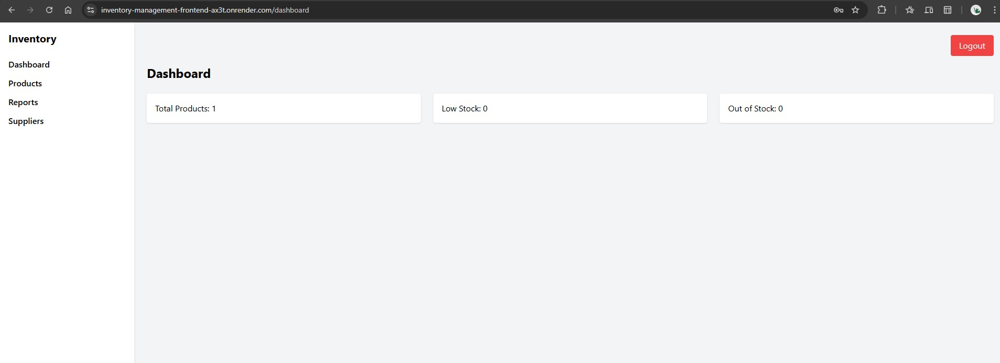

# 📦 Inventory Management System

A modern, responsive inventory management system with a React frontend and FastAPI backend. Built to help businesses efficiently track and manage their inventory, products, and suppliers.



## 🚀 Live Demo

- **Frontend URL:** [https://inventory-management-frontend-ax3t.onrender.com](https://inventory-management-frontend-ax3t.onrender.com)
- **Backend API:** [https://inventory-backend-16mw.onrender.com](https://inventory-backend-16mw.onrender.com)

## ✨ Features

### � Authentication
- Secure login system
- Protected routes
- Session management

### 📊 Dashboard
- Real-time inventory overview
- Quick stats and insights
- Recent activities

### 📦 Product Management
- Add, edit, and delete products
- Categorize products
- Track product details (SKU, price, quantity, etc.)

### 📈 Stock Management
- Stock In/Out tracking
- Low stock alerts
- Stock movement history

### 📋 Reports
- Sales reports
- Inventory valuation
- Stock level reports
- Export to PDF/Excel

### 👥 Supplier Management
- Manage supplier information
- Track purchase orders
- Supplier performance metrics

## � Tech Stack

### Frontend
- ⚛️ React 18 with TypeScript
- 🎨 Tailwind CSS for styling
- 🚀 Vite for fast development
- 🔄 React Router for navigation
- 📱 Fully responsive design

### Backend
- 🐍 FastAPI
- 🗄️ PostgreSQL database
- 🔒 JWT Authentication
- 🚀 Deployed on Render

## 🚀 Getting Started

### Prerequisites
- Node.js (v16 or later)
- npm or yarn
- Git

### Installation

1. **Clone the repository**
   ```bash
   git clone https://github.com/kunalnandiwadekar/inventory-management-frontend.git
   cd inventory-management-frontend
   ```

2. **Install dependencies**
   ```bash
   npm install
   # or
   yarn install
   ```

3. **Environment Setup**
   Create a `.env` file in the root directory and add:
   ```env
   VITE_API_URL=https://inventory-backend-16mw.onrender.com
   ```

4. **Run the development server**
   ```bash
   npm run dev
   # or
   yarn dev
   ```

5. **Build for production**
   ```bash
   npm run build
   # or
   yarn build
   ```

## 🔐 Demo Access

Use the following credentials to test the application:

- **Username:** `admin`
- **Password:** `admin123`

## 📦 Deployment

The application is deployed on **Render** as a static site. The deployment is automatically triggered on pushes to the `main` branch.

### Build Command
```bash
npm run build
```

### Publish Directory
```
dist
```

## 🧭 Project Structure

```
src/
├── assets/          # Static assets
├── components/      # Reusable components
├── pages/           # Page components
├── hooks/           # Custom React hooks
├── utils/           # Utility functions
├── types/           # TypeScript type definitions
└── App.tsx          # Main application component
```

## 🤝 Contributing

Contributions are welcome! Please follow these steps:

1. Fork the repository
2. Create your feature branch (`git checkout -b feature/AmazingFeature`)
3. Commit your changes (`git commit -m 'Add some AmazingFeature'`)
4. Push to the branch (`git push origin feature/AmazingFeature`)
5. Open a Pull Request


## 👨‍� Author

- **Kunal Nandiwadekar**
- GitHub: [@kunalnandiwadekar](https://github.com/kunalnandiwadekar)
- LinkedIn: [Your LinkedIn](https://www.linkedin.com/in/kunal-nandiwadekar/)
- Portfolio: [Your Portfolio](https://kunalnandiwadekar.github.io/)


